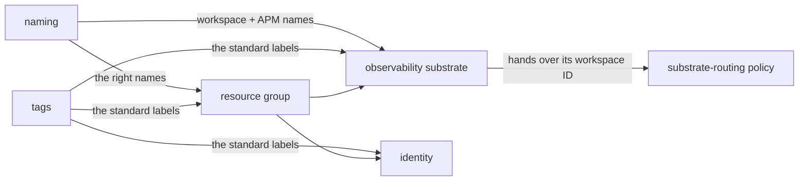
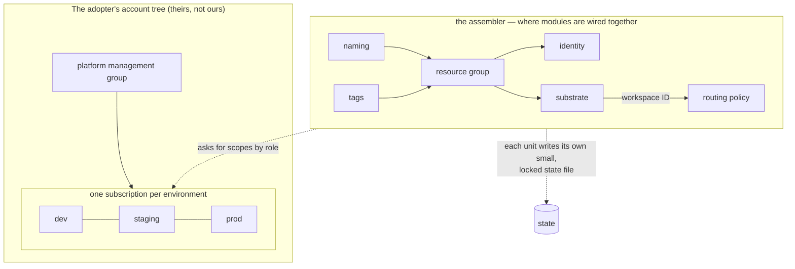

# The Vitruvius Handbook

*A user's manual and a manifesto, in one document. The manifesto explains what this platform believes and why; the manual explains what is in the box and how to adopt it. Written so that any engineer — and any manager willing to read carefully — can understand every part without prior cloud or platform vocabulary.*

---

## How to read this

Three audiences, three paths:

- **Evaluating** ("should we use this?") — read Part I (the manifesto) and Part II (what's in the box), then skim Part V (what's deliberately not built). That's the honest whole of it.
- **Adopting** ("we're using this; now what?") — read Part III (the adoption guide) with Part II open in a second window.
- **Presenting** ("I have to explain this to people") — Part VI is a ready-to-deliver pitch with answers to the hard questions, and the Glossary backs you up on every term.

Terms are defined the first time they appear. A few you'll see constantly, defined once here:

- **Platform (as in "platform team").** The internal team that builds the paved roads other engineering teams drive on — shared infrastructure, tooling, and rules, so application teams don't each reinvent them.
- **Azure.** Microsoft's cloud — rented computing, databases, networking, and hundreds of other services you turn on with code instead of buying hardware.
- **Terraform.** A tool that lets you describe cloud infrastructure in text files and then creates it for you. This is **infrastructure as code (IaC)**: infrastructure defined in files you can review, version, and re-run, instead of clicked together by hand in a web console.
- **ADR (Architecture Decision Record).** A short document capturing *one* decision: the situation, the choice, what was deliberately left open, and how hard it would be to reverse. This repository has 21 of them, each written in plain language, and they are the durable asset everything else implements.
- **Module.** A reusable building block of Terraform code — a packaged recipe for "a properly configured Key Vault" or "the central logging store" — that anyone can drop into their own configuration.

> **In plain terms:** the repository is a *library of opinions*. The opinions are written down as ADRs (the "why"), implemented as modules (the "how"), and proven by automated checks (the "really?"). An organization can adopt all of it or just the pieces it likes.

One idea runs underneath everything: **this is a reference foundation, not a finished company's setup.** The adopter's real networks, account IDs, and regulatory specifics aren't known while the reference is built. So the architecture decides the *shapes and the rules* — which are safe to decide now — and leaves the *specific values* as clearly-labeled blanks with sensible defaults. Almost every "why" in this handbook comes back to that one idea.

---

# Part I — The manifesto

## The three tests

The project is named for Vitruvius, the Roman architect who said good buildings need three things: *firmitas* (it stands up), *utilitas* (it's useful), *venustas* (it's pleasing). Every decision and every module here is reviewed against all three:

- **Durable (firmitas).** Does it survive failure, an audit, and the original author quitting? Secure by default, least-privilege access, encryption everywhere, and the policy that enforces all of that shipping *with* the thing it governs.
- **Useful (utilitas).** Does it make the right way the easy way? Infrastructure that is technically correct but painful to use gets bypassed — so usefulness is an engineering requirement, not a nicety. The minimal example of every module fits on one screen.
- **Elegant (venustas).** Can someone read it and understand it? An unreadable system is one nobody can audit or safely change. Legibility *is* a safety property.

These three pull against each other on purpose. Maximum durability (forbid everything) kills usefulness; maximum usefulness (no rules) kills durability. The ADRs are the record of where each balance landed.

## The five convictions

**1. Golden paths, not gold cages.** A **golden path** is a pre-built, well-supported way to do a common thing — "here's the blessed way to deploy a web API." Take it, and the hard cross-cutting concerns — identity, observability, secrets, networking, naming, tagging — are handled for you. Leave it, and you're allowed to: you take ownership of those concerns yourself and write a short ADR saying why. Nothing is forbidden; the paved road is just *so much easier* that almost nobody bothers to pave their own.

**2. Decide the contract; defer the specifics.** Every decision fixes an agreed-on *shape* — like the plug shape of an electrical outlet — and deliberately leaves the *specific values* for later. Shapes are cheap to keep stable; a specific value baked in too early (a network address range, a vendor) is expensive to rip out once things depend on it. Every ADR carries two sections that enforce this: **"What this does not decide"** (the blanks, named explicitly) and **"Reversibility"** (is this a *two-way door* you can walk back, or a *one-way door* you can't — and what would undoing it cost).

**3. Composition, not orchestration.** Modules are wired together by passing one module's **outputs** (the values it produces) into another's **inputs** — never by reaching inside each other, and never through a "master module" that calls everything. The place where modules get wired together is therefore a complete, readable description of what exists. Think LEGO: you snap the bricks together yourself, in the open. You don't build a robot brick that secretly assembles the others, because then you can't see what the model is.

**4. Docs that cannot lie.** Hand-maintained documents drift from the code they describe — silently, until an audit finds it. So the load-bearing documents here are *generated* from structured data and *checked* in CI: the ADR index regenerates from the ADRs' own metadata, every module's spec sheet (its **manifest**) is validated against the module's actual code on every change, and the docs that describe controls distinguish explicitly between "live today" and "planned." A control described as live when it is not is exactly the audit finding this discipline exists to prevent.

**5. Design with engineers, not at them.** Significant decisions ship as **RFCs** — drafts opened for comment — and an architect can propose a decision but cannot approve their own. Patterns earn status (experimental → beta → stable) by being adopted, not by being declared ready. This is the antidote to the deepest failure mode in the catalog: the architect who designs in isolation, swoops in with corrections, and leaves.

## The twelve failure modes

A large part of the architecture is the deliberate avoidance of twelve specific traps — failure modes experienced engineers have watched land, over and over, across companies. Each has a catalog entry (`docs/anti-patterns.md`) with what it looks like, why it keeps happening (usually structure, not stupidity), what it costs, and which decision blocks it.

| # | The trap | The one-line cure |
|---|---|---|
| AP-001 | Bolted-on monitoring — a separate team adds dashboards later | Every module ships its own monitoring and policy (ADR 0003) |
| AP-002 | Telemetry dumping ground — centralize everything, curate nothing | One central store *with enforced rules* — budgets, retention, owners (ADR 0005) |
| AP-003 | Hard-coded service endpoints | "Find each other" is three problems; use three tools (ADR 0006) |
| AP-004 | Configuration drift — hand fixes diverge from code | Read-only production; emergencies captured back into code (ADR 0007) |
| AP-005 | Sweeping policy bans with no escape hatch | Rules watch before they block, and exceptions are a fast process (ADR 0008) |
| AP-006 | Secret-rotation toil | Temporary identities instead of stored passwords (ADR 0009) |
| AP-007 | Change-management theater — a board approving what it can't evaluate | The reviewed pull request *is* the approval record (ADR 0007) |
| AP-008 | Tag chaos — `env=prod`, `Env=Production`, `environment=PROD` | Five mandatory, spell-checked tags that drive automation (ADR 0010) |
| AP-009 | Doc rot — documentation that drifts and loses trust | Generate the load-bearing docs; check them in CI (ADRs 0011, 0016, 0021) |
| AP-010 | No golden paths — every team invents everything | Provide genuinely good paths, designed with the teams (ADR 0012) |
| AP-011 | Lower-environment signal gap — staging flies blind | The same monitoring everywhere; only retention differs (ADR 0005) |
| AP-012 | Seagull architecture — design by fly-by | Open RFCs; no self-approval; adoption-gated patterns (ADR 0012) |

> **In plain terms:** almost none of these traps are caused by people being dumb. They're caused by *structure* — bad team boundaries, misaligned incentives, defaults that make the wrong thing easier than the right thing. The whole philosophy is to fix the structure so the easy path and the correct path are the same path.

---

# Part II — What's in the box

## The map

```
vitruvius/
  docs/
    principles.md            # the three tests, made operational — and what CI enforces today vs planned
    golden-paths.md          # the golden-path contract and the six cross-cutting concerns
    composition.md           # how modules layer; which shapes are forbidden
    anti-patterns.md         # the twelve failure modes
    decisions/               # 21 plain-language ADRs + a generated index
  modules/
    foundation/              # naming, tags, diagnostic-settings, identity
    platform-services/       # observability-substrate (more planned)
    workload-patterns/       # web-api-aks (more planned)
    networking/              # planned: hub, spoke, private endpoints (v0.2)
  examples/
    reference-landingzone/   # the assembler: everything wired together, end to end
  policies/ncua-glba/        # compliance scaffold — content awaits the compliance partners
  schemas/                   # JSON Schema for the module manifests
  scripts/                   # the validators and generators CI runs
  .github/workflows/ci.yml   # the checks (see "What the checks prove")
```

## The six modules

Every module ships the same way: a **manifest** (`manifest.yaml`, its machine-readable spec sheet), a README, agent guidance, Terraform code pinned to exact versions of the **Azure Verified Modules (AVM)** it builds on (a vetted parts catalog from Microsoft and HashiCorp — the rule is *don't hand-build a part the catalog already sells*), its own policy and monitoring, runnable examples, and automated tests that run against a stand-in for Azure (no real account needed).

One shape repeats across all six, and it's worth spotting: a module **takes names and tags as inputs** (it doesn't invent them) and **asks for accounts and scopes by role** (it doesn't create them). That is composition-by-output (ADR 0004) and attach-by-role (ADR 0024) showing up as a consistent house style.

**`foundation/naming`** — pure logic; creates nothing in the cloud. Give it the org, workload, environment, and region; it returns the correct standardized name for each resource type (`rg-wsx-platform-dev-eus-01`, …). Inputs are validated hard — no leading, trailing, or doubled hyphens that Azure would reject at deploy time — and when a name would exceed a resource type's length cap, it falls back to a compact form with a deterministic hash, never silent truncation. *Why it matters:* predictable names are what make the catalog, dashboards, and drift detection trustworthy.

**`foundation/tags`** — the tag taxonomy made executable. Produces the standard tag map from the five required, vocabulary-controlled inputs (`owner`, `env`, `cost-center`, `data-classification`, `business-criticality`) and — when given a management group — ships the **ten-policy initiative** that enforces the taxonomy estate-wide: require + allowed-values policies for resources, the same requirement applied to resource groups themselves (resource groups are where tags inherit *from*, so they can't be exempt), and an inherit-from-resource-group policy that auto-copies missing tags using the least-privilege Tag Contributor role. Promotion from watching to blocking is one input (`policy_effect = "Deny"`) backed by evidence — and a plan-time invariant fails any build where the policy JSON vocabularies drift from the module's own.

**`foundation/diagnostic-settings`** — the monitoring safety net. Ships the policy initiative that detects (and, once promoted, repairs) any Key Vault, AKS cluster, Service Bus, App Service, or API Management instance whose logs aren't routing to the central workspace. It takes the workspace ID as an input — it doesn't own the workspace — and it grants its own remediation identity the exact roles repair requires, because Azure only auto-grants those when an assignment is created by hand in the portal. *Why it matters:* it's the enforcement half of the observability story — whatever slips past the golden path gets caught here.

**`foundation/identity`** — deliberately tiny. Two managed identities (Azure-native identities with no passwords): one for the deployment pipeline, one for policy remediation. It grants them no permissions itself — that's the adopter's call, made in the open at the assembly point.

**`platform-services/observability-substrate`** — the central monitoring store: a Log Analytics workspace (the log store and query engine) plus workspace-based Application Insights (application performance monitoring), an alert-routing group, and a self-protection alert that fires if anyone attempts to delete the workspace. Private by default — and honestly so: both the workspace *and* Application Insights have public ingestion and query explicitly disabled (the upstream defaults disagree with each other, so this module sets them rather than trusting them), which makes a consumer-provided **Azure Monitor Private Link Scope (AMPLS)** a documented hard prerequisite for private operation, not a surprise. Its workspace ID output is the seam the whole observability story hangs on.

**`workload-patterns/web-api-aks`** — the one complete golden path: a web API on **AKS** (Azure's managed Kubernetes). It wires **workload identity** — the application proves *who it is* with short-lived federated tokens instead of holding a password — to an AVM-built Key Vault that is reachable *only* through private endpoints (the input is right there; supply your subnet), with diagnostics routing to the platform workspace and a hardening policy bundle whose names derive from the workload's own Key Vault, so a second workload in the same subscription can't collide with the first. Adopt it and identity, secrets, monitoring, and hardening come for free.

## The assembler

`examples/reference-landingzone` is the proof that the pieces snap together: one readable file that creates a resource group and wires naming → tags → identity → the substrate → the routing policy, each module's outputs feeding the next, no module reaching inside another. It uses obviously-fake example values with validated defaults, passes all checks with no input, and is the file an adopter copies and fills in.



The load-bearing arrow is the last one: the substrate *produces* the central workspace, and the routing policy *enforces* that everything sends logs there — the two halves of the observability decision connected in the open.

## What the checks prove

Every push runs, in CI:

- **Format and validity** — `terraform fmt` and `terraform validate` across every module and example.
- **Tests** — every module's `terraform test` suite (over a hundred assertions across the six), including negative tests that prove the input validation actually rejects what it claims to.
- **Manifest validation** — every module's manifest parses, validates against the JSON Schema, and **agrees with the module's actual code**: inputs mirror `variables.tf` (names and required-ness, both directions), outputs mirror `outputs.tf`, declared dependencies match what's really used, declared policy and monitoring artifacts actually exist, examples and tests on disk are all declared, and every cited decision and anti-pattern resolves. Every policy JSON is syntax-checked.
- **Coverage by construction** — the lists of modules and examples to check are *discovered from the repository*, not hand-maintained, so a new module physically cannot merge without CI coverage.
- **Index drift** — the ADR index is regenerated and compared; a malformed ADR is a hard failure, not a silent omission.

> **In plain terms:** the spec sheet can't lie about the code, the docs index can't lose a decision, and nothing ships untested — and none of that depends on a human remembering to check.

**And honestly:** some controls are decided but not yet built — static-analysis scanning, the manifest's softer semantic warnings, the compliance-map generator, the OTel collector deployment, scheduled drift detection. `docs/principles.md` § "How these are enforced" is the canonical live-vs-planned list, and the rule of the house is that audit-facing text never describes a planned control as live.

---

# Part III — Adopting it

This is the user's-manual part. The platform was built to be adopted in pieces or whole; here is the order of operations either way.

## Step 0 — Decide your posture

Three valid postures:

1. **Take the opinions only.** Adopt the ADRs and anti-pattern catalog as your decision baseline and write your own code. The decisions are the durable asset; this is a legitimate adoption.
2. **Take modules à la carte.** Each module stands alone — `naming` and `tags` are useful on day one in any estate, with zero coupling to the rest.
3. **Take the foundation whole.** Copy the assembler, fill in your values, and grow from there. The rest of Part III assumes this posture.

## Step 1 — Bring your account structure; don't rebuild it

Vitruvius **attaches to your existing Azure account tree by role; it does not own the tree.** Modules ask for scopes through a small fixed vocabulary — *the platform management group*, *the environment subscription*, *the workload resource group* — and you hand them the real IDs at the assembly point (ADR 0024). An **environment is a subscription**: dev, staging, and production each get their own account, which gives each a clean security, billing, and policy boundary. If you run Microsoft's standard **Azure Landing Zones** layout, everything here drops onto it; the platform assumes your landing zone already creates subscriptions on demand and consumes that, it doesn't rebuild it.

> **In plain terms:** the modules say "deploy this to the production environment" the way a job description says "send this to the Head of Finance" — by role, not by employee number. You tell them which actual account holds each role, once, in one file.

## Step 2 — Copy the assembler and fill in the blanks

Copy `examples/reference-landingzone` into your own repository and replace the obviously-fake values: your org short-code, your region, your management group ID. Every input is validated with a real error message at plan time — a bare management-group name, an off-vocabulary environment, a malformed ID all fail *before* anything talks to Azure. Then extend it the same way the example is built: instantiate a module, read its outputs, feed the next.

State — Terraform's memory of what it built — goes in your own Azure Storage, locked like the secret store it effectively is (identity-only access, no shared keys, customer-managed encryption, private networking) and **split** per environment and per deployable unit so one mistake's blast radius is one small unit (ADR 0017). Start split; merging later is easy, splitting later is surgery.

## Step 3 — Face the networking prerequisites early

Two truths the repo tells you plainly rather than letting you discover in week three:

- The substrate is **private by default**, which means *nothing can ingest into it or query it* until you provide an **AMPLS** (Azure Monitor Private Link Scope) wired to private DNS and private endpoints. For an evaluation sandbox you may flip the two `internet_*` inputs to `true` — that is the documented escape hatch, not the default.
- The golden path's Key Vault is reachable **only** through a private endpoint — supply your subnet and private-DNS zone through the `private_endpoints` input, or the workload will hold a role on a vault it cannot reach.

The network itself follows a **hub-and-spoke** design (ADR 0018): a central hub holds the shared services (firewall, private DNS, gateways), every workload lives in a spoke connected only to the hub, all outbound traffic is denied by default and exits through one audited choke point. The *topology and the addressing discipline* are decided; the hub module that implements them is the next major build (tracked as issue #9), and the address ranges are yours — non-overlapping, centrally assigned, written down, because re-numbering a live network is the truest one-way door in the whole design.

## Step 4 — Turn on policy the disciplined way

Every policy bundle in the repo follows one lifecycle (ADR 0008): **watch first, block with evidence.** Deploy the initiative in audit mode (the default — both the enforcement mode and the effect ship safe), let it observe for 30–90 days, then promote with a pull request that cites what it *would* have blocked and who owns those resources. Promotion is a single input on each module (`policy_effect = "Deny"`), not a JSON-editing expedition. Sandbox and dev stay watch-only forever; production blocks once the evidence supports it. Exemptions are first-class: time-boxed, team-attributed, logged.

The one exception to watch-first: rules that protect the monitoring system itself are meant to block from day one. Today the substrate ships a detective alert on attempted deletion; the preventive deny is an acknowledged deferral, stated in the module's README.

## Step 5 — Wire your pipeline to the controls, not the brand

The change-management rules (ADR 0007, ADR 0020) are the decision; the CI/CD product is configuration. The rules: humans are read-only in production by default; the reviewed pull request is the change record; a plan runs on every PR but deploys only happen after merge, gated by an approver who isn't the author, promoted dev → staging → production; the pipeline logs in with **OIDC federation** — short-lived tokens, no stored passwords — holding only the access it needs; every deployment writes a **ledger entry** automatically (the audit record *and* the source of the delivery metrics); emergencies go through break-glass and are captured back into code within 24 hours, never forbidden into the shadows.

This repository's own CI (GitHub Actions) is the live partial implementation of those rules; the reference write-up uses Azure DevOps vocabulary and the conversion is tracked (issue #5). Either platform — or another — satisfies the ADR; the controls are what the auditors get.

## Step 6 — Bring your compliance partners in with something concrete

The compliance machinery is built; the compliance *content* is deliberately yours. Every policy initiative declares, as data, which controls it satisfies — framework-qualified identifiers like `csf:PR.AC-1` or `ncua:748-app-a.II` — and the control map and evidence pack are *generated* from those declarations, so they cannot drift from the rules (ADR 0021). What the platform refuses to do is invent the control catalog alone: which controls are in scope, and whether a given policy satisfies an examiner, is your security and compliance partners' call. One important nuance the repo gets right and many don't: for federally insured credit unions, GLBA's safeguards are examined under **NCUA 12 CFR Part 748** — the FTC's better-known Safeguards Rule (16 CFR 314) applies to non-bank institutions. The framework-qualified identifiers make that a content choice, not a redesign.

## Deviating from a golden path

You don't have to fight the platform — you have to document the deviation. Write a short ADR; identify the six cross-cutting concerns you're now carrying yourself (identity, observability, secrets, networking, naming, tagging); show your alternative meets the same audit bar; get sign-off from the platform and security reviewers. Deviations are *feedback about the pattern*, not a team failing — repeated deviations in the same direction mean the pattern should change.

---

# Part IV — The decisions, by story

Twenty-one decisions, four stories. Each ADR is written in plain language and stands alone; this is the connective tissue.

## Story 1 — The infrastructure

*The platform owns the shapes and rules; the adopter owns the specific values.*

**Terraform on AVM** (0001) is the foundation tool — reserve your effort for judgment, not plumbing. **Composition, not orchestration** (0004) is the assembly rule. **Attach by role** (0024) is how it plugs into your account tree without owning it. **Split, vault-like state** (0017) is where the record of what's deployed lives.



> **Say it like this:** "We don't own the customer's account tree — we plug into it by role, so the same modules work on any standard setup. Modules are wired together in one open file by passing outputs into inputs, so that file *is* the readable description of the system. And Terraform's memory of what's deployed is locked like a vault and split per unit, so a mistake can only damage one small piece."

## Story 2 — Compliance and governance

*A chain of decisions, each removing a way the previous one could rot or be abused.*

**Modules bring their own rules** (0003) so governance can't drift from what it governs. **Watch before block** (0008) so enforcement is evidence-based. **A small, enforced, working tag set** (0010) so cost-tracking and automation can be trusted. **A compliance map generated from the rules** (0021) so the document a regulator asks for can't go stale.


> **Say it like this:** "Every rule ships with the module it governs, watches before it blocks, and graduates on evidence. Tags are five mandatory, spell-checked labels that actually drive automation — enforced on resource groups too, since that's where tags inherit from. The compliance map is generated from declarations the rules carry, so it can't drift. We built the machine; the compliance experts decide the actual controls — including which GLBA regime applies."

## Story 3 — Monitoring and measurement

*One format decision, then three layers of using the data.*

**One open format** (0002, OpenTelemetry) so the storage vendor is a setting, not a migration. **One curated central store** (0005) with standards, cost budgets, and the same coverage in every environment — you can't catch in staging what staging doesn't record. Then two disciplines that *use* the data: **delivery metrics** (0013, the four DORA measures plus time-to-first-deploy and self-service rate) and **reliability targets** (0014, SLOs and error budgets).

The split that repeats three times (0013, 0014, 0015): **the platform builds the machinery; each team owns its numbers.** Reliability targets, recovery targets, and delivery targets are set *with* the teams that run the services, never dictated — and a backup that has never been restored is treated as what it is: an unverified hope. Restore drills are annual and recorded.

> **Say it like this:** "Everything emits one open format to a per-environment collector, so switching vendors is a config change. The central store is curated — standards and budgets on the way in, equal coverage everywhere, so bugs surface in rehearsal instead of in front of members. Then we actually use the data: delivery metrics and reliability targets with real error budgets. The platform builds the instruments; each team sets its own numbers."

## Story 4 — Change and security

*Make the safe way the easy way, and make every action leave a trustworthy trail.*

**Temporary identities, not stored passwords** (0009) — nothing to steal, nothing to rotate; the rare unavoidable long-lived secret is a documented, automated, annually-reviewed exception. **Change is code** (0007) — the review is the approval, the receipts are automatic, emergencies are captured rather than forbidden. **A passwordless, gated pipeline** (0020) carries those rules. **Service discovery is three problems with three tools** (0006) — runtime lookup inside the cluster, one governed front door (API Management) for anything crossing a boundary including the vendor-hosted core on another cloud, and a human-facing catalog that is deliberately not in the traffic path.

> **Say it like this:** "There are no stored passwords to rotate — services and the pipeline log in with expiring identities. Change is code: the reviewed pull request is the authorization, the system writes the deployment ledger automatically, drift is detected, and emergency fixes are folded back into code within a day. It's a stronger control set than a change-approval board, and faster — regulators ask for outcomes, and this produces them with higher fidelity."

## Every decision in one line

| ADR | In one line |
|---|---|
| 0001 | Terraform on the trusted AVM catalog; don't rebuild plumbing. |
| 0002 | Collect monitoring in one open format; the vendor is a setting. |
| 0003 | Every module ships its own rules and monitoring. |
| 0004 | Wire modules by outputs into inputs; no master module. |
| 0005 | One curated central monitoring store; equal coverage everywhere. |
| 0006 | "Find each other" is three problems; use three tools. |
| 0007 | Change is code; the review is the approval; emergencies are captured. |
| 0008 | New rules watch before they block, and graduate with evidence. |
| 0009 | Temporary identities instead of stored passwords. |
| 0010 | Five mandatory, spell-checked tags that do real work. |
| 0011 | Every module ships a structured spec sheet — and CI proves it matches the code. |
| 0012 | Design *with* engineers; an architect can't approve their own work. |
| 0013 | Measure the platform; start with the four DORA metrics. |
| 0014 | Teams set their own reliability targets; the platform builds the tooling. |
| 0015 | Teams own recovery targets; the platform supplies tools and real drills. |
| 0016 | Decide how the catalog is generated now; stand up the portal later. |
| 0017 | Lock the state like a vault; split it so a mistake can't spread. |
| 0018 | Hub-and-spoke network, default-deny exits, shared private addressing. |
| 0020 | A passwordless, gated pipeline that records every release. |
| 0021 | Generate the compliance map from the rules so it can't go stale. |
| 0024 | Attach to the customer's account tree by role; don't reinvent it. |

Numbering is monotonic, not dense: **0019, 0022, and 0023 are reserved slots** for decisions drafted as open RFCs — platform identity and privileged access (#10), customer-managed keys and the secrets platform (#14), and FinOps as a cross-cutting concern (#16). A gap is a seat held for a decision, not a deleted record.

---

# Part V — What was deliberately left undone

This section is easy to mistake for a to-do list. It is the opposite: each item was *deliberately* not built, because building it would have meant guessing about a real organization that isn't known yet. For each: what's decided, what's open, and what would make it time to build.

- **The networking hub module.** The topology, the default-deny posture, and the addressing discipline are decided (ADR 0018), and the module's output contract is written down for the v0.2 implementation (issue #9). The address ranges themselves are the adopter's.
- **The OTel collector deployment.** The most load-bearing unbuilt artifact in the observability story — the substrate it writes into is real; the collector runs on application compute and lands with the first workload that needs it.
- **The Backstage portal.** The catalog *contract* is decided: each module's catalog entry generates from its manifest, so the catalog can't rot (ADR 0016, generator tracked in #12). The running portal waits for real triggers — an estate to catalog, enough services that a portal beats a spreadsheet, someone assigned to operate it.
- **The compliance control catalog.** The mapping contract and generation machinery are decided (ADR 0021); the catalog content — which controls, satisfied by which policies, under which GLBA regime — belongs to the security and compliance partners (scaffold tracked in #13).
- **Platform identity and privileged access** (reserved as ADR 0019, issue #10), **customer-managed keys and the secrets platform** (ADR 0022, #14), **FinOps as a cross-cutting concern** (ADR 0023, #16), and the **AKS cluster baseline** the golden path consumes — each is a real decision that deserves its own RFC, not a paragraph smuggled into someone else's.
- **All the concrete real-world values.** Account IDs, address ranges, regions, retention numbers per environment, every team's reliability and recovery targets — labeled blanks with sensible defaults, because the real environment is unknown and guesses age into liabilities.

> **In plain terms:** a reference design that *pretended* to know your network ranges, compliance catalog, and CI vendor would be worse, not more finished — it would be full of confident guesses that are probably wrong and expensive to undo. Knowing the difference between "a shape safe to decide now" and "a value I'd only be guessing at" is the discipline this whole repository exists to demonstrate. The deferrals *are* the architecture.

---

# Part VI — Presenting it

## The two-minute pitch

> Vitruvius is a reference platform foundation for a regulated financial institution on Azure. Three ideas carry it. First, every opinion is a written decision record that says *why* and what it deliberately leaves open — twenty-one of them, in plain language anyone on the team can read. Second, the boring-but-critical cross-cutting work — security rules, monitoring, secret handling — is built *into* every building block, not bolted on later by another team. Third, it decides the *shapes and rules* and leaves the *specific values* to the adopter, because their real environment isn't known yet. Concretely: Terraform on the vetted AVM catalog; six tested modules that snap together by passing outputs into inputs, never through a master module; monitoring in one open format so the vendor is a setting; rules that watch before they block; temporary identities instead of stored passwords; change managed entirely through reviewed code with an automatic audit trail; and a compliance map generated from the rules so it cannot go stale. The spec sheet of every module is validated against its actual code on every change — the documentation physically can't drift. And the parts that touch the real company — network ranges, the account tree, the control catalog — are labeled blanks, on purpose.

## The hard questions, answered

**"How do you know any of this works if it's never been deployed to production?"** Every module carries automated tests that run against a stand-in for Azure — over a hundred assertions, including negative tests proving the validations reject what they claim to. The assembler proves the modules compose end to end, in CI, on every change. And the repo is precise about the difference between *proven* (contracts, wiring, validation, policy syntax) and *needs a real estate* (an actual apply, AMPLS connectivity, remediation at scale). That honesty is a feature: the docs distinguish live controls from planned ones everywhere, because a control described as live when it isn't is an audit finding.

**"Why no one-click 'deploy everything' module?"** Because that's how systems become unreadable (ADR 0004). A master module hides what's deployed and breeds more master modules. Instead the assembly file is the readable description of the system — slightly more verbose, infinitely more auditable.

**"Policy that only watches sounds weak. Why not enforce on day one?"** A blanket ban with no escape hatch drives engineers to unmanaged accounts — the opposite of control. Watch-first makes enforcement evidence-based: a rule reports for 30–90 days, and turning on blocking is a reviewed change citing what it would have blocked and whether it was catching real problems. Promotion is one input. Exemptions are a fast, logged, expiring process — so nobody routes around the system.

**"You're a credit union — where's PCI? And is your GLBA mapping right?"** PCI is explicitly out of scope, not half-done. And the mapping contract is regime-aware: federally insured credit unions are examined under NCUA 12 CFR 748 — the FTC Safeguards Rule everyone googles first applies to non-bank lenders. Which regime, and which controls, is declared data supplied by the compliance partners; the generated map keeps it current either way.

**"What stops the docs from rotting like every other wiki?"** The load-bearing docs aren't prose anyone maintains — they're generated and checked. The ADR index regenerates from the decisions themselves; each module's spec sheet is machine-validated against its real inputs, outputs, artifacts, and citations on every pull request; the compliance map generates from rule declarations. The remaining prose follows one rule, enforced by review: never describe a planned control as live.

**"What's the single most important idea?"** Decide the contract; defer the specifics. Everything else — attach by role, generate the catalog, swap the CI vendor, teams own their numbers — is that one idea applied somewhere new. It's what lets a reference design be genuinely useful before the real environment exists, without painting anyone into a corner.

## Drill prompts

1. Walk the assembler from naming to the routing policy, naming each seam.
2. Trace one change from "code written" to "live in production": PR, plan, gate, deploy, ledger, drift check.
3. Explain three different ways a Key Vault ends up monitored.
4. Explain why *how finely you split state* is hard to reverse but *which product stores it* is easy.
5. Name the three places "platform builds the machinery, team owns the numbers" appears.
6. Explain how the compliance map is produced and why it can't go stale.
7. Name three things deliberately not built, and the trigger that would make each timely.

---

# Glossary

**ADR (Architecture Decision Record).** A short document capturing one decision: situation, choice, what was left open, reversibility. This repo has 21, written in plain language.

**AKS (Azure Kubernetes Service).** Azure's managed Kubernetes — runs containerized applications and handles the cluster plumbing.

**ALZ (Azure Landing Zones).** Microsoft's standard blueprint for organizing an Azure account tree. Vitruvius plugs into it rather than replacing it.

**AMPLS (Azure Monitor Private Link Scope).** The construct that lets monitoring data flow over private networking. A hard prerequisite for the substrate's private-by-default posture; the adopter provides it.

**Application Insights.** Azure's application-performance monitoring service — response times, failures, request traces.

**Audit / Deny.** The two modes of a policy rule: *Audit* watches and reports; *Deny* blocks. Rules here start in Audit and graduate on evidence (ADR 0008).

**AVM (Azure Verified Modules).** A vetted catalog of pre-built Terraform building blocks from Microsoft and HashiCorp. House rule: don't rebuild a part the catalog already sells — and pin the exact version you tested.

**Blast radius.** How much damage one mistake can cause. Splitting things (like state files) keeps it small.

**Break-glass.** An explicitly-allowed emergency change path — permitted, logged, and folded back into code within 24 hours.

**Cardinality.** Roughly, how many distinct label-combinations your monitoring data has. High cardinality is what makes monitoring bills explode; it's budgeted at the collector (ADR 0005).

**CI/CD.** *Continuous Integration* (automatically build and test every change) and *Continuous Delivery* (automatically release it). The software assembly line.

**CMK (customer-managed key).** Encryption where the organization holds the key rather than the cloud provider. Used for the state store; the broader key-management decision is reserved as ADR 0022.

**Collector (OpenTelemetry Collector).** The middleman that receives all monitoring data and forwards it to whichever backend is configured. Decided, not yet deployed.

**Composition.** Wiring building blocks by passing outputs into inputs, in the open. The opposite of *orchestration* — a master module calling others — which is forbidden (ADR 0004).

**Control / control map.** A specific security or compliance requirement (e.g. from NIST CSF), and the document saying which rule enforces each. Generated, never hand-kept (ADR 0021).

**Deployment ledger.** The automatic, tamper-evident record of every deployment: which change, which version, where, who approved. Audit record and metrics source in one.

**Diagnostic settings.** Azure's "send this resource's logs to a workspace" feature. The safety-net module ensures it's set everywhere.

**DORA metrics.** Four standard delivery measures: deployment frequency, lead time, change failure rate, time to recovery.

**Drift.** When the real system diverges from what the code says — usually a hand-edit. Detected on a schedule; emergencies are captured, not forbidden.

**Egress.** Outbound network traffic. Denied by default; exits only through the hub's audited choke point (ADR 0018).

**Error budget.** The allowed slice of failure inside a reliability target. Spend it, and risky changes pause (ADR 0014).

**Exemption.** An approved, documented, expiring exception to a policy rule — attached to a team, not a person (ADR 0008).

**GLBA.** The Gramm-Leach-Bliley Act, U.S. financial-privacy law. For federally insured credit unions its safeguards are examined under **NCUA 12 CFR Part 748**; the FTC's Safeguards Rule (16 CFR 314) covers non-bank institutions. Which regime applies is the compliance partners' determination.

**Golden path.** A pre-built, well-supported way to do a common thing. A path, not a cage — leaving it is allowed and documented.

**Hub-and-spoke.** Network layout: a central hub of shared services; per-workload spokes that connect only to the hub, never to each other.

**IaC (infrastructure as code).** Infrastructure defined in reviewable, versioned, re-runnable text files.

**Identity (managed / workload).** A system proving *who it is* instead of presenting a stored password. *Managed identity* is Azure vouching for a service; *workload identity* is the same for Kubernetes apps via short-lived federated tokens.

**Initiative.** A named bundle of related policy rules, with a single promotion lever.

**Key Vault.** Azure's secure store for secrets, keys, and certificates. Here: private-endpoint-only, purge-protected, RBAC-authorized.

**Log Analytics.** Azure's log store and query engine — the substrate's core.

**Management group.** A folder that groups Azure subscriptions so one rule can govern many accounts.

**Manifest.** The structured spec sheet (`manifest.yaml`) every module ships — inputs, outputs, artifacts, citations — validated against the module's actual code in CI (ADR 0011).

**NCUA.** The National Credit Union Administration — the U.S. regulator that examines credit unions.

**NIST CSF.** A standard catalog of cybersecurity controls (codes like `PR.AC-1`), one of the mapping targets for compliance.

**OIDC (OpenID Connect).** The open standard behind "sign in with…" — used so the pipeline logs into Azure with expiring tokens instead of a stored password.

**OpenTelemetry (OTel).** The open, vendor-neutral format for logs, metrics, and traces. Emit once; choose the backend by configuration.

**PIM (Privileged Identity Management).** Azure's "check out elevated rights for an hour, with a logged reason" feature — the only path to manual production change.

**Policy (Azure Policy).** Azure's built-in engine for automatically checking and enforcing rules across all resources.

**Private endpoint.** Reaching a cloud service over your private network instead of the public internet. Requires private DNS, centralized in the hub.

**Pull request (PR).** A proposed change others review before merge. Here, the PR is the official change record.

**RFC (Request for Comments).** A draft opened for critique before it's final. Significant ADRs ship this way; reserved ADR numbers are open RFCs.

**RTO / RPO.** Most downtime you can tolerate / most data you can afford to lose. Owned by each team, per environment, with the platform supplying the tools and drills.

**SLI / SLO.** The reliability measurement and the target set on it ("99.9% of requests succeed"). Teams own the numbers.

**State / backend.** Terraform's record of what it built and where that record lives. It contains secrets — locked like a vault, split per unit.

**Subscription.** An Azure account that holds resources and gets a bill. Here: one per environment.

**Tag.** A label on a cloud resource. Five are mandatory, spell-checked, enforced — on resource groups too — and each drives real automation.

**Terraform test.** Terraform's built-in test framework. Every module's suite runs in CI against a mocked Azure, no credentials needed.

**Two-way / one-way door.** Reversibility shorthand: walk back through a two-way door freely; think hard before a one-way door. Every ADR labels itself.

**VNet (virtual network).** A private network in Azure. Workloads in spokes; shared services in the hub.

**Workload identity federation.** The passwordless trust between a Kubernetes service account and an Azure identity — the golden path's secret-free login.

---

*The repository is the primary source; this handbook is the map. Start with `docs/principles.md`, keep `docs/decisions/README.md` open, and read any ADR the moment you wonder "why on earth did they do it that way?" — that question is exactly what each one was written to answer.*
