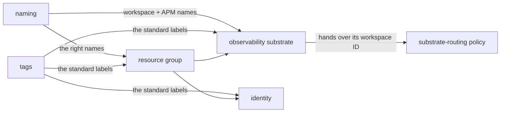
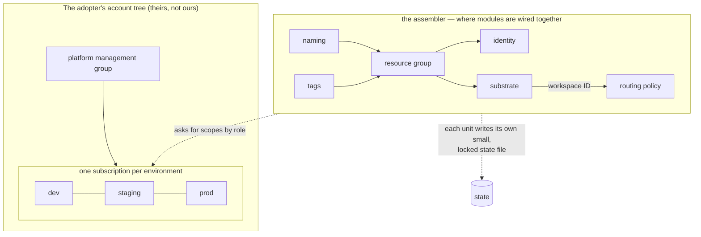
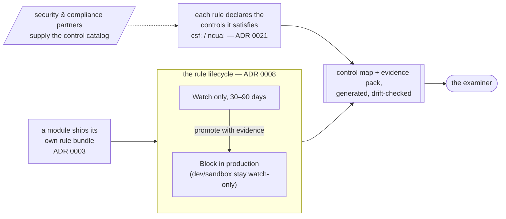

# The Vitruvius Handbook

*An implementation guide for adopting this reference architecture on Azure. It explains what the architecture is, why it is shaped the way it is, and how to stand it up in your own organization. Written so that any engineer — and any manager willing to read carefully — can follow it without prior cloud or platform-engineering vocabulary.*

---

## How to read this

Two audiences, two paths:

- **Evaluating** ("is this right for us?") — read Part I (why the architecture is shaped this way) and Part II (what's in the box), then Part V (what you'll need to add yourself). That's the honest whole of it.
- **Implementing** ("we're adopting it; now what?") — work through Part III (the implementation guide) with Part II open as reference, and reach for Part IV whenever you want the reasoning behind a specific decision.

Terms are defined the first time they appear. A few you'll see constantly, defined once here:

- **Platform (as in "platform team").** The internal team that builds the paved roads other engineering teams drive on — shared infrastructure, tooling, and rules, so application teams don't each reinvent them.
- **Azure.** Microsoft's cloud — rented computing, databases, networking, and hundreds of other services you turn on with code instead of buying hardware.
- **Terraform.** A tool that lets you describe cloud infrastructure in text files and then creates it for you. This is **infrastructure as code (IaC)**: infrastructure defined in files you can review, version, and re-run, instead of clicked together by hand in a web console.
- **ADR (Architecture Decision Record).** A short document capturing *one* decision: the situation, the choice, what was deliberately left open, and how hard it would be to reverse. This repository has twenty-two accepted ones plus one open RFC, each written in plain language, and they are the durable asset everything else implements.
- **Module.** A reusable building block of Terraform code — a packaged recipe for "a properly configured Key Vault" or "the central logging store" — that anyone can drop into their own configuration.

> **In plain terms:** the repository is a *library of opinions*. The opinions are written down as ADRs (the "why"), implemented as modules (the "how"), and proven by automated checks (the "really?"). An organization can adopt all of it or just the pieces it likes.

One idea runs underneath everything: **this is a reference foundation, not a finished company's setup.** The adopter's real networks, account IDs, and regulatory specifics aren't known while the reference is built. So the architecture decides the *shapes and the rules* — which are safe to decide now — and leaves the *specific values* as clearly-labeled blanks with sensible defaults. Almost every "why" in this handbook comes back to that one idea.

---

# Part I — Why the architecture is shaped this way

## The three tests

The project is named for Vitruvius, the Roman architect who said good buildings need three things: *firmitas* (it stands up), *utilitas* (it's useful), *venustas* (it's pleasing). Every decision and every module here is reviewed against all three:

- **Durable (firmitas).** Does it survive failure, an audit, and the original author quitting? Secure by default, least-privilege access, encryption everywhere, and the policy that enforces all of that shipping *with* the thing it governs.
- **Useful (utilitas).** Does it make the right way the easy way? Infrastructure that is technically correct but painful to use gets bypassed — so usefulness is an engineering requirement, not a nicety. The minimal example of every module fits on one screen.
- **Elegant (venustas).** Can someone read it and understand it? An unreadable system is one nobody can audit or safely change. Legibility *is* a safety property.

These three pull against each other on purpose. Maximum durability (forbid everything) kills usefulness; maximum usefulness (no rules) kills durability. The ADRs are the record of where each balance landed.

## The five principles

**1. Golden paths, not gold cages.** A **golden path** is a pre-built, well-supported way to do a common thing — "here's the blessed way to deploy a web API." Take it, and the hard cross-cutting concerns — identity, observability, secrets, networking, naming, tagging — are handled for you. Leave it, and you're allowed to: you take ownership of those concerns yourself and write a short ADR saying why. Nothing is forbidden; the paved road is just *so much easier* that almost nobody bothers to pave their own.

**2. Decide the contract; defer the specifics.** Every decision fixes an agreed-on *shape* — like the plug shape of an electrical outlet — and deliberately leaves the *specific values* for later. Shapes are cheap to keep stable; a specific value baked in too early (a network address range, a vendor) is expensive to rip out once things depend on it. Every ADR carries two sections that enforce this: **"What this does not decide"** (the blanks, named explicitly) and **"Reversibility"** (is this a *two-way door* you can walk back, or a *one-way door* you can't — and what would undoing it cost).

**3. Composition, not orchestration.** Modules are wired together by passing one module's **outputs** (the values it produces) into another's **inputs** — never by reaching inside each other, and never through a "master module" that calls everything. The place where modules get wired together is therefore a complete, readable description of what exists. Think LEGO: you snap the bricks together yourself, in the open. You don't build a robot brick that secretly assembles the others, because then you can't see what the model is.

**4. Docs that cannot lie.** Hand-maintained documents drift from the code they describe — silently, until an audit finds it. So the load-bearing documents here are *generated* from structured data and *checked* in CI: the ADR index regenerates from the ADRs' own metadata, every module's spec sheet (its **manifest**) is validated against the module's actual code on every change, and the docs that describe controls distinguish explicitly between "live today" and "planned." A control described as live when it is not is exactly the audit finding this discipline exists to prevent.

**5. Design with engineers, not at them.** Significant decisions ship as **RFCs** — drafts opened for comment — and an architect can propose a decision but cannot approve their own. Patterns earn status (experimental → beta → stable) by being adopted, not by being declared ready. This is the antidote to the deepest failure mode in the catalog: the architect who designs in isolation, swoops in with corrections, and leaves. The process isn't theoretical: the platform-identity decision (ADR 0019) is open as a draft RFC right now, accumulating comment before anyone is allowed to call it accepted.

## How decisions actually get made here

The principles say *what* the architecture rests on; this is *how* its choices actually get made. Every decision starts with one question: **which way does the door swing?**

A **two-way door** is a choice you can walk back — a retention number, a default region, a SKU. Spend little on it, pick a sensible value, move on; being wrong is cheap. A **one-way door** is a choice other things will calcify around — how finely Terraform state is split, the network addressing plan, the manifest's field names, whether modules may call each other. These get the deliberation, the written alternatives, and the RFC period, because being wrong is expensive *later*, when the cost is no longer visible in the decision itself.

The subtle cases are the doors that *change* direction over time, and the ADRs call these out explicitly. Resource names were a two-way door until exemptions and the compliance map started binding to them — so they were genericized the week before that binding began. The no-orchestrator rule is *mechanically* trivial to reverse and *strategically* one-way, because the first orchestrator module attracts the second. Standing read-only access is technically a config flip but culturally a ratchet. Recognizing a door mid-swing — and acting while it's still cheap — is most of the actual work of architecture.

The second habit follows from the first: **when you can't know, don't guess — defer visibly.** Every ADR carries a "What this does not decide" section naming its blanks, so the boundary between "decided" and "your job, later" is always written down rather than discovered. Deferral here is not backlog; it's the deliberate refusal to bake in a guess that would be expensive to dig out. The discipline applied across the whole repository is exactly this discrimination: shapes that are safe to decide now get decided to a high polish, values that would be guesses get labeled blanks with sensible defaults.

And third: **a deferral must name its trigger,** or it's just procrastination with better branding. The Backstage portal waits for a real estate, a dozen-plus entities, and a named operator. The module registry waits for enough consumers that discovery beats a git tag. When a trigger fires, the deferral graduates — the catalog generator and the compliance-map machinery both started as named deferrals and are now running code, which is the system working as designed, not the plan changing.

## The twelve failure modes

A large part of the architecture is the deliberate avoidance of twelve specific traps — failure modes experienced engineers have watched land, over and over, across companies. Each has a catalog entry (`docs/anti-patterns.md`) with what it looks like, why it keeps happening (usually structure, not stupidity), what it costs, and which decision blocks it.

| # | The trap | The one-line cure |
|---|---|---|
| AP-001 | Bolted-on monitoring — a separate team adds dashboards later | Every module ships its own monitoring and policy (ADR 0003) |
| AP-002 | Telemetry dumping ground — centralize everything, curate nothing | One central store *with enforced rules* — budgets, retention, owners (ADR 0005) |
| AP-003 | Hard-coded service endpoints | "Find each other" is three problems; use three tools (ADR 0006) |
| AP-004 | Configuration drift — hand fixes diverge from code | Read-only production; emergencies captured back into code (ADR 0007) |
| AP-005 | Sweeping policy bans with no escape hatch | Rules watch before they block, and exceptions are a fast process (ADR 0008) |
| AP-006 | Secret-rotation toil | Temporary identities instead of stored passwords (ADR 0009) |
| AP-007 | Change-management theater — a board approving what it can't evaluate | The reviewed pull request *is* the approval record (ADR 0007) |
| AP-008 | Tag chaos — `env=prod`, `Env=Production`, `environment=PROD` | Five mandatory, spell-checked tags that drive automation (ADR 0010) |
| AP-009 | Doc rot — documentation that drifts and loses trust | Generate the load-bearing docs; check them in CI (ADRs 0011, 0016, 0021) |
| AP-010 | No golden paths — every team invents everything | Provide genuinely good paths, designed with the teams (ADR 0012) |
| AP-011 | Lower-environment signal gap — staging flies blind | The same monitoring everywhere; only retention differs (ADR 0005) |
| AP-012 | Seagull architecture — design by fly-by | Open RFCs; no self-approval; adoption-gated patterns (ADR 0012) |

> **In plain terms:** almost none of these traps are caused by people being dumb. They're caused by *structure* — bad team boundaries, misaligned incentives, defaults that make the wrong thing easier than the right thing. The whole philosophy is to fix the structure so the easy path and the correct path are the same path.

---

# Part II — What's in the box

## The map

```
vitruvius/
  docs/
    principles.md            # the three tests, made operational — and what CI enforces today vs planned
    golden-paths.md          # the golden-path contract and the six cross-cutting concerns
    composition.md           # how modules layer; which shapes are forbidden
    anti-patterns.md         # the twelve failure modes
    decisions/               # 22 plain-language ADRs + a generated index
  modules/
    foundation/              # naming, tags, diagnostic-settings, identity, policy-baseline
    platform-services/       # observability-substrate (more planned)
    workload-patterns/       # web-api-aks (more planned)
    networking/              # hub (VNet, private DNS, AMPLS); firewall + spokes v0.2
  examples/
    reference-landingzone/   # the assembler: the platform team's side, wired end to end
    workload-onboarding/     # the app team's side: consuming the golden path
  policies/ncua-glba/        # declared control mappings + the generated control map
  schemas/                   # JSON Schema for the module manifests
  scripts/                   # the validators and generators CI runs
  .github/workflows/ci.yml   # the checks (see "What the checks prove")
```

## The eight modules

Every module ships the same way: a **manifest** (`manifest.yaml`, its machine-readable spec sheet), a README, agent guidance, Terraform code pinned to exact versions of the **Azure Verified Modules (AVM)** it builds on (a vetted parts catalog from Microsoft and HashiCorp — the rule is *don't hand-build a part the catalog already sells*), its own policy and monitoring, runnable examples, and automated tests that run against a stand-in for Azure (no real account needed).

One shape repeats across all eight, and it's worth spotting: a module **takes names and tags as inputs** (it doesn't invent them) and **asks for accounts and scopes by role** (it doesn't create them). That is composition-by-output (ADR 0004) and attach-by-role (ADR 0024) showing up as a consistent house style.

**`foundation/naming`** — pure logic; creates nothing in the cloud. Give it the org, workload, environment, and region; it returns the correct standardized name for each resource type (`rg-wsx-platform-dev-eus-01`, …). Inputs are validated hard — no leading, trailing, or doubled hyphens that Azure would reject at deploy time — and when a name would exceed a resource type's length cap, it falls back to a compact form with a deterministic hash, never silent truncation. *Why it matters:* predictable names are what make the catalog, dashboards, and drift detection trustworthy.

**`foundation/tags`** — the tag taxonomy made executable. Produces the standard tag map from the five required, vocabulary-controlled inputs (`owner`, `env`, `cost-center`, `data-classification`, `business-criticality`) and — when given a management group — ships the **ten-policy initiative** that enforces the taxonomy estate-wide: require + allowed-values policies for resources, the same requirement applied to resource groups themselves (resource groups are where tags inherit *from*, so they can't be exempt), and an inherit-from-resource-group policy that auto-copies missing tags using the least-privilege Tag Contributor role. Promotion from watching to blocking is one input (`policy_effect = "Deny"`) backed by evidence — and a plan-time invariant fails any build where the policy JSON vocabularies drift from the module's own.

**`foundation/diagnostic-settings`** — the monitoring safety net. Ships the policy initiative that detects (and, once promoted, repairs) any Key Vault, AKS cluster, Service Bus, App Service, or API Management instance whose logs aren't routing to the central workspace. It takes the workspace ID as an input — it doesn't own the workspace — and it grants its own remediation identity the exact roles repair requires, because Azure only auto-grants those when an assignment is created by hand in the portal. *Why it matters:* it's the enforcement half of the observability story — whatever slips past the golden path gets caught here.

**`foundation/identity`** — deliberately tiny. Two managed identities (Azure-native identities with no passwords): one for the deployment pipeline, one for policy remediation. It grants them no permissions itself — that's the adopter's call, made in the open at the assembly point.

**`foundation/policy-baseline`** — the estate guardrail, and the answer to "what stops someone standing up a public App Service?" Assigned at a management group, it ships the mandatory rules every subscription beneath it inherits — App Service public access disabled and HTTPS-only, Storage public-blob access denied, resources confined to approved regions — as block-or-watch policies (and because they *block* rather than *repair*, no remediation identity is needed, unlike the diagnostic safety net). Like every bundle it watches before it blocks (ADR 0008); one input promotes it to Deny. *Why it matters:* a golden path makes the right thing easy, but it's opt-in — this makes the wrong thing impossible, estate-wide, whether or not a team used a golden path (ADR 0025 §1).

**`platform-services/observability-substrate`** — the central monitoring store: a Log Analytics workspace (the log store and query engine) plus workspace-based Application Insights (application performance monitoring), an alert-routing group, and a self-protection alert that fires if anyone attempts to delete the workspace. Private by default — and honestly so: both the workspace *and* Application Insights have public ingestion and query explicitly disabled (the upstream defaults disagree with each other, so this module sets them rather than trusting them), which makes a consumer-provided **Azure Monitor Private Link Scope (AMPLS)** a documented hard prerequisite for private operation, not a surprise. Its workspace ID output is the seam the whole observability story hangs on.

**`networking/hub`** — the decided core of the network (ADR 0018). A hub virtual network, the centralized private DNS zones the shipped modules require (the default list is exactly what they need, not a guess), and the **AMPLS** that makes the substrate's private-by-default posture actually work, with the observability resources scoped into it. It deliberately stops where the next line would be a guess: the firewall — product, SKU, egress rules — waits for a real estate's requirements (#9), and the control map declares the resulting default-deny-egress gap out loud rather than pretending. *Why it matters:* private operation needs somewhere private to land, and this is it; the addressing discipline is locked in now, while re-numbering is still free.

**`workload-patterns/web-api-aks`** — the one complete golden path: a web API on **AKS** (Azure's managed Kubernetes). It wires **workload identity** — the application proves *who it is* with short-lived federated tokens instead of holding a password — to an AVM-built Key Vault that is reachable *only* through private endpoints (the input is right there; supply your subnet), with diagnostics routing to the platform workspace and a hardening policy bundle whose names derive from the workload's own Key Vault, so a second workload in the same subscription can't collide with the first. Adopt it and identity, secrets, monitoring, and hardening come for free.

## The assembler

`examples/reference-landingzone` is the proof that the pieces snap together: one readable file that creates a resource group and wires naming → tags → identity → the substrate → the routing policy, each module's outputs feeding the next, no module reaching inside another. It uses obviously-fake example values with validated defaults, passes all checks with no input, and is the file an adopter copies and fills in.



The load-bearing arrow is the last one: the substrate *produces* the central workspace, and the routing policy *enforces* that everything sends logs there — the two halves of the observability decision connected in the open.

The assembler has a mirror image: `examples/workload-onboarding` is the same composition seen from the *app team's* chair — the root a workload team copies into its own repository to consume the golden path, with every platform-published fact arriving as an explicit input and the module pinned by release tag. Together the two examples answer the question that matters most about any platform: not "can the platform team build it?" but "what does it feel like to be its customer?"

## What the checks prove

Every push runs, in CI:

- **Format and validity** — `terraform fmt` and `terraform validate` across every module and example.
- **Tests** — every module's `terraform test` suite (over a hundred assertions across the eight), including negative tests that prove the input validation actually rejects what it claims to.
- **Manifest validation** — every module's manifest parses, validates against the JSON Schema, and **agrees with the module's actual code**: inputs mirror `variables.tf` (names and required-ness, both directions), outputs mirror `outputs.tf`, declared dependencies match what's really used, declared policy and monitoring artifacts actually exist, examples and tests on disk are all declared, and every cited decision and anti-pattern resolves. Every policy JSON is syntax-checked.
- **Generated views can't drift** — three derived documents are regenerated on every pull request and fail the build if they don't match their source: the ADR index (from the decisions' own metadata), each module's Backstage `catalog-info.yaml` (from its manifest), and the compliance control map (from the declared mappings — which also fails if a mapping references a policy file that no longer exists).
- **Coverage by construction** — the lists of modules and examples to check are *discovered from the repository*, not hand-maintained, so a new module physically cannot merge without CI coverage.

> **In plain terms:** the spec sheet can't lie about the code, the catalog can't lie about the modules, the compliance map can't lie about the rules, and nothing ships untested — and none of that depends on a human remembering to check. The clearest way to see each gate is to break it: rename a policy the control map cites and the build refuses.

The catalog half of this was validated against the real consumer: a throwaway Backstage instance ingested the generated entities — one Domain, four Systems, eight Components — with zero schema errors, then was deleted. The claim "point your Backstage at this repo and the catalog populates" is a tested fact, while *operating* a portal still waits for its triggers (ADR 0016).

**And honestly:** some controls are decided but not yet built — static-analysis scanning, the manifest's softer semantic warnings, the OTel collector deployment, scheduled drift detection. `docs/principles.md` § "How these are enforced" is the canonical live-vs-planned list, and the rule of the house is that audit-facing text never describes a planned control as live.

---

# Part III — Implementing it

This part is the implementation guide. It opens with the concrete order of operations a platform team follows to stand the foundation up, then explains the reasoning behind each major move — because every adopter's estate differs, and the *why* is what lets you adapt the steps to yours. The mechanical detail lives in two places, each with a README that is the actual instruction manual: `examples/reference-landingzone` for the platform team's side, `examples/workload-onboarding` for an application team's.

## Standing it up: the order of operations

A platform team brings the foundation up in roughly this order. Each step points at where the mechanics live; the rest of Part III is the reasoning behind the steps.

1. **Choose your adoption posture** (next section) — the opinions only, modules à la carte, or the whole foundation. Steps 2–8 assume the whole foundation; take fewer if you're adopting less.
2. **Map the four scope roles onto your account tree.** The modules attach to Azure by *role*, never by hard-coded ID (ADR 0024): the platform management group, the landing-zone management group, an environment subscription, and a workload resource group. Decide which real management groups and subscriptions play those roles. The platform sits *on top of* Azure Landing Zones — if you don't run ALZ yet, that is the prerequisite to establish first; the platform does not replace it.
3. **Create the state backend before anything else.** Terraform's record of what it built is a sensitive artifact (ADR 0017): a locked storage account, split per environment and per deployable unit from the start. Splitting state later is surgery; starting split costs nothing.
4. **Provide the network prerequisites.** The observability substrate is private by default, which means it does not work until you supply an **AMPLS** wired to private DNS (ADR 0018). Stand up `networking/hub` first so the substrate — and later, your workloads' private endpoints — have somewhere private to land.
5. **Copy `examples/reference-landingzone` as your platform root and fill in the blanks.** Org code, region, the management-group and subscription IDs from step 2, your address space. Every adopter-supplied value is validated at *plan* time with an error that names the actual mistake, so a wrong value costs a minute, not an afternoon's failed apply. This root wires naming → tags → identity → the substrate → diagnostic routing → the hub → the estate guardrails, each module's outputs feeding the next.
6. **Run it through your pipeline.** Plan on the pull request; apply after a non-author approval, promoted environment by environment (ADR 0020). The reference CI is GitHub Actions; moving to Azure DevOps (or anything else) maps the same controls onto a different vendor and changes no architecture.
7. **Turn enforcement on gradually.** Every policy bundle — the tag taxonomy, diagnostic routing, and the estate guardrails (`policy-baseline`) — ships in **Audit**. Watch for 30–90 days, confirm nothing legitimate trips, then promote to **Deny** with a single input, citing in the PR what the rule would have blocked (ADR 0008).
8. **Onboard application teams.** Each team copies `examples/workload-onboarding` into its own repository, pins a workload-pattern module by release tag, and receives the platform's published facts — workspace ID, cluster issuer, subnet IDs — as explicit inputs. They consume the platform; they never read its state.

## Adoption is a spectrum, not a commitment

Three postures are equally legitimate, because the layers were built to separate. Take **the opinions only** — the ADRs and anti-pattern catalog as your decision baseline, with your own code underneath; the decisions are the durable asset, and an estate that adopts the reasoning has adopted the architecture. Take **modules à la carte** — `naming` and `tags` earn their keep on day one in any estate, with zero coupling to the rest; that independence isn't an accident, it's ADR 0004 doing its job. Or take **the foundation whole** — copy the assembler, fill in your values, grow from there. The design never punishes partial adoption, because forcing the whole stack is how platforms get routed around (AP-005, AP-010).

## You bring the estate; the platform brings the shape

The deepest adoption question is who owns what, and the answer runs through everything: **The platform attaches to your existing Azure account tree by role; it never owns the tree** (ADR 0024). Modules ask for scopes through a small vocabulary — *the platform management group*, *the environment subscription* — and you hand them real IDs once, at the assembly point. The reasoning: any reference design that ships an account tree is shipping its author's org chart, and the adopter either contorts to fit it or forks it. Attach-by-role sidesteps both. The same reasoning makes **an environment a subscription** — not because Azure requires it, but because a subscription is the cleanest security, billing, and policy boundary Azure offers, and environments are exactly the thing you want cleanly bounded.

> **In plain terms:** the modules say "deploy this to the production environment" the way a job description says "send this to the Head of Finance" — by role, not by employee number.

Filling in the blanks is deliberately front-loaded and validated: every adopter-supplied value in the assembler fails at *plan time* with an error naming the actual mistake, because a guess that survives until apply costs an afternoon and a guess that dies at plan costs a minute. And the first blank worth thinking hardest about is **state**: Terraform's record of what it built is effectively a secret store, so it's locked like one — and it's **split** per environment and per deployable unit before there's anything in it, because merging state later is an afternoon and splitting it later is surgery (ADR 0017). That asymmetry, not tidiness, is why the reference starts split.

## The prerequisites are stated, not discovered

A reference design earns trust by what it admits before you hit it. Two admissions matter most here. The substrate is **private by default — which means it doesn't work yet**: nothing can ingest into it or query it until you provide an AMPLS wired to private DNS, and the golden path's Key Vault is reachable only through a private endpoint you supply. The alternative — shipping open defaults that "just work" — is how regulated estates accumulate public endpoints nobody remembers approving. Private-by-default with a *documented* dependency is the honest version: the cost is visible, scheduled, and paid once, instead of discovered in week three or, worse, never.

The network those prerequisites point at is now half-built, along the line the decision drew: `networking/hub` ships the *decided core* — the hub VNet, the centralized private DNS zones (whose default list is exactly what the shipped modules require), and the AMPLS itself, with the substrate's resources scoped in. What it deliberately does **not** ship is the firewall: product, SKU, and rule shape are decisions that would be made blind today and reversed when a real estate's egress requirements exist (#9). Until then default-deny egress is unenforced, and the control map says so out loud. The addressing discipline, meanwhile, is locked in *now*, while it's free, because re-numbering a live network is the truest one-way door in the whole design.

## Enforcement is earned, not declared

Every policy bundle follows one lifecycle (ADR 0008): **watch first, block with evidence.** Initiatives ship observing — both the enforcement mode and the effect default safe — and promotion to blocking is a pull request citing what *would* have been blocked, who owns it, and whether the rule caught real problems or noise. Promotion is a single input (`policy_effect = "Deny"`), because a promotion path that requires editing policy JSON is a promotion path nobody takes. Sandbox and dev stay watch-only forever; exemptions are time-boxed, team-attributed, and logged.

The reasoning is incentive design, not caution: a blanket ban costs its author nothing and lands its pain on everyone else, which is exactly how engineers end up on unmanaged personal subscriptions. Evidence-gated enforcement reverses the incentive — and the one stated exception (rules protecting the monitoring system block from day one) shows the principle has edges, not just vibes. The estate-wide promotion judgment stays with the platform and security teams; what the modules guarantee is that the lifecycle is *cheap to follow and visible to audit*.

That lifecycle governs *how* a rule turns on. A separate question is *which* rules a workload can't escape — and the answer isn't the golden path, because a golden path is opt-in, and ADR 0004 explicitly lets a team fork one and trim it. So the **mandatory** controls don't live in the workload's box at all: `foundation/policy-baseline` ships them as an estate guardrail assigned at the management group — no public App Services, HTTPS-only, no public blobs, approved regions — inherited by every subscription beneath it whether or not a team used a golden path. The rule (ADR 0025 §1): if leaving a control out would make the estate non-compliant, the platform owns whether it exists, not the workload. And at the gate, a deployment declares what *kind* of thing it is, and CI checks its plan against that profile before merge. Golden path makes compliance easy; the baseline makes non-compliance impossible; the conformance check proves it before it ships.

## The pipeline is controls, not a brand

What auditors need from change management is outcomes: who changed what, who approved it, can the author approve themselves, what happens in an emergency. So the decision (ADRs 0007, 0020) fixes the *controls* — read-only production for humans, the reviewed PR as the change record, deploys gated by a non-author approver and promoted environment by environment, OIDC-federated pipeline identity with no stored credentials, an automatic deployment ledger, break-glass that is captured back into code within 24 hours rather than forbidden into the shadows — and treats the CI/CD product as configuration. This repository's own CI is the live partial implementation; the Azure DevOps port is tracked (#5). An adopter with a different pipeline loses nothing, because the controls were never about the vendor.

## Compliance partners get artifacts, not blank pages

The platform's compliance posture rests on a refusal: it will not invent the control catalog alone, because a platform team's solo guess at "which controls matter" produces a map that matches nobody's actual risk (AP-012 in compliance clothing). What it builds instead is the *machine* — every initiative declares the controls it satisfies as framework-qualified data (`csf:PR.AC-1`, `ncua:748-app-a.III.C`), and the control map is generated from those declarations with gaps shown explicitly, never silently (ADR 0021).

That machine is now running with exemplar content: `policies/ncua-glba/CONTROL-MAP.md` maps two control families to policies that actually ship, with all three coverage states visible — implemented, manual, and one *declared gap*. The exemplars exist for a specific conversational reason: compliance partners react far better to a concrete claim they can correct than to a blank page they must fill. Each accepted correction becomes a data edit; the map regenerates; CI guarantees it never drifts from the rules it describes. One nuance the content gets right: federally insured credit unions are examined under **NCUA 12 CFR Part 748**, not the FTC's better-known Safeguards Rule — and because identifiers are framework-qualified, even getting *that* wrong would have been a content fix, not a redesign.

## Deviation is data

If a golden path doesn't fit, the contract is documentation, not combat: a short ADR naming the six cross-cutting concerns the team now carries itself, evidence the alternative meets the same audit bar, platform and security sign-off. The design reason: a platform that *forbids* deviation drives it underground where it can't be audited, while a platform that *prices* deviation honestly — you own the hard parts, in writing — keeps the trail visible and learns from it. Repeated deviations in the same direction are treated as the pattern's failure, not the teams': that feedback loop is what keeps golden paths worth paving.

---

# Part IV — The decisions, by story

Twenty-two decisions, four stories. Each ADR is written in plain language and stands alone; this is the connective tissue.

## Story 1 — The infrastructure

*The platform owns the shapes and rules; the adopter owns the specific values.*

**Terraform on AVM** (0001) is the foundation tool — reserve your effort for judgment, not plumbing. **Composition, not orchestration** (0004) is the assembly rule. **Attach by role** (0024) is how it plugs into your account tree without owning it. **Split, vault-like state** (0017) is where the record of what's deployed lives.



## Story 2 — Compliance and governance

*A chain of decisions, each removing a way the previous one could rot or be abused.*

**Modules bring their own rules** (0003) so governance can't drift from what it governs. **Watch before block** (0008) so enforcement is evidence-based. **A small, enforced, working tag set** (0010) so cost-tracking and automation can be trusted. **A compliance map generated from the rules** (0021) so the document a regulator asks for can't go stale. **The mandatory controls are platform-owned** (0025) — assigned estate-wide at a management group — so a workload can't quietly omit them by skipping the golden path.



## Story 3 — Monitoring and measurement

*One format decision, then three layers of using the data.*

**One open format** (0002, OpenTelemetry) so the storage vendor is a setting, not a migration. **One curated central store** (0005) with standards, cost budgets, and the same coverage in every environment — you can't catch in staging what staging doesn't record. Then two disciplines that *use* the data: **delivery metrics** (0013, the four DORA measures plus time-to-first-deploy and self-service rate) and **reliability targets** (0014, SLOs and error budgets).

The split that repeats three times (0013, 0014, 0015): **the platform builds the machinery; each team owns its numbers.** Reliability targets, recovery targets, and delivery targets are set *with* the teams that run the services, never dictated — and a backup that has never been restored is treated as what it is: an unverified hope. Restore drills are annual and recorded.

## Story 4 — Change and security

*Make the safe way the easy way, and make every action leave a trustworthy trail.*

**Temporary identities, not stored passwords** (0009) — nothing to steal, nothing to rotate; the rare unavoidable long-lived secret is a documented, automated, annually-reviewed exception. **Change is code** (0007) — the review is the approval, the receipts are automatic, emergencies are captured rather than forbidden. **A passwordless, gated pipeline** (0020) carries those rules. **Service discovery is three problems with three tools** (0006) — runtime lookup inside the cluster, one governed front door (API Management) for anything crossing a boundary including the vendor-hosted core on another cloud, and a human-facing catalog that is deliberately not in the traffic path.

## Every decision in one line

| ADR | In one line |
|---|---|
| 0001 | Terraform on the trusted AVM catalog; don't rebuild plumbing. |
| 0002 | Collect monitoring in one open format; the vendor is a setting. |
| 0003 | Every module ships its own rules and monitoring. |
| 0004 | Wire modules by outputs into inputs; no master module. |
| 0005 | One curated central monitoring store; equal coverage everywhere. |
| 0006 | "Find each other" is three problems; use three tools. |
| 0007 | Change is code; the review is the approval; emergencies are captured. |
| 0008 | New rules watch before they block, and graduate with evidence. |
| 0009 | Temporary identities instead of stored passwords. |
| 0010 | Five mandatory, spell-checked tags that do real work. |
| 0011 | Every module ships a structured spec sheet — and CI proves it matches the code. |
| 0012 | Design *with* engineers; an architect can't approve their own work. |
| 0013 | Measure the platform; start with the four DORA metrics. |
| 0014 | Teams set their own reliability targets; the platform builds the tooling. |
| 0015 | Teams own recovery targets; the platform supplies tools and real drills. |
| 0016 | Decide how the catalog is generated now; stand up the portal later. |
| 0017 | Lock the state like a vault; split it so a mistake can't spread. |
| 0018 | Hub-and-spoke network, default-deny exits, shared private addressing. |
| 0020 | A passwordless, gated pipeline that records every release. |
| 0021 | Generate the compliance map from the rules so it can't go stale. |
| 0024 | Attach to the customer's account tree by role; don't reinvent it. |
| 0025 | A deployment declares what it is; CI proves its plan conforms; mandatory controls are platform-owned. |

Numbering is monotonic, not dense: a gap is a seat held for a decision, not a deleted record. **ADR 0019** (platform identity and privileged access — group-based access, just-in-time elevation, break-glass, separation of duties) has graduated from reserved slot to **open draft RFC**, accumulating comment per ADR 0012 before anyone may call it accepted — the collaborative process running in public, not described. **0022** (customer-managed keys and the secrets platform, #14) and **0023** (FinOps as a cross-cutting concern, #16) remain reserved.

---

# Part V — What's not included, and when to add it

This section is easy to mistake for a to-do list. It is the opposite: each item was *deliberately* not built, because building it would have meant guessing about a real organization that isn't known yet. For each: what's decided, what's open, and what would make it time to build.

- **The firewall — but no longer the hub.** `networking/hub` now ships the decided core (hub VNet, centralized private DNS, the AMPLS) and the non-firewall half of ADR 0018 §6's output contract. What stays deferred is egress *enforcement*: firewall product, SKU, and rule shape wait for a real estate's requirements (issue #9), and the control map declares the resulting `csf:PR.AC-5` gap explicitly rather than hiding it — the deferral and the compliance story tell one consistent truth.
- **The OTel collector deployment.** The most load-bearing unbuilt artifact in the observability story — the substrate it writes into is real; the collector runs on application compute and lands with the first workload that needs it.
- **The Backstage portal — but no longer the catalog.** The generator shipped, and the contract was validated against a real Backstage instance (it ingested everything cleanly, then was deleted). What remains deferred is exactly what should be: *operating* a portal, which waits for an estate to catalog, enough services that a portal beats a spreadsheet, and a named operator.
- **The compliance control catalog — but no longer the machine.** The generator and drift gate run in CI, and two exemplar control families ship as concrete claims. What remains deferred is the *content* judgment — which controls, satisfied by which policies, to which examiner's standard — because that belongs to the security and compliance partners (#13), and a platform team answering it alone is the seagull trap in compliance clothing.
- **Decisions still in flight.** Platform identity and privileged access is now an open RFC (ADR 0019, #10) rather than a reserved number; **customer-managed keys and the secrets platform** (ADR 0022, #14), **FinOps as a cross-cutting concern** (ADR 0023, #16), and the **AKS cluster baseline** the golden path consumes each still deserve their own RFC, not a paragraph smuggled into someone else's.
- **All the concrete real-world values.** Account IDs, address ranges, regions, retention numbers per environment, every team's reliability and recovery targets — labeled blanks with sensible defaults, because the real environment is unknown and guesses age into liabilities.

Notice the pattern in the first four bullets: deferrals here don't just sit — they *graduate* when their triggers fire. The catalog generator and the compliance machine were both named deferrals in earlier versions of this very section; both are now running code, and what remains deferred in each is precisely the part whose trigger hasn't fired. That's the deferral discipline working as designed.

> **In plain terms:** a reference design that *pretended* to know your network ranges, compliance catalog, and CI vendor would be worse, not more finished — it would be full of confident guesses that are probably wrong and expensive to undo. Knowing the difference between "a shape safe to decide now" and "a value I'd only be guessing at" is the discipline this whole repository embodies. The deferrals *are* the architecture.

---

# Glossary

**ADR (Architecture Decision Record).** A short document capturing one decision: situation, choice, what was left open, reversibility. This repo has 22, written in plain language.

**AKS (Azure Kubernetes Service).** Azure's managed Kubernetes — runs containerized applications and handles the cluster plumbing.

**ALZ (Azure Landing Zones).** Microsoft's standard blueprint for organizing an Azure account tree. The platform plugs into it rather than replacing it.

**AMPLS (Azure Monitor Private Link Scope).** The construct that lets monitoring data flow over private networking. A hard prerequisite for the substrate's private-by-default posture; `networking/hub` provisions it and scopes the substrate's resources into it.

**Application Insights.** Azure's application-performance monitoring service — response times, failures, request traces.

**Audit / Deny.** The two modes of a policy rule: *Audit* watches and reports; *Deny* blocks. Rules here start in Audit and graduate on evidence (ADR 0008).

**AVM (Azure Verified Modules).** A vetted catalog of pre-built Terraform building blocks from Microsoft and HashiCorp. House rule: don't rebuild a part the catalog already sells — and pin the exact version you tested.

**Blast radius.** How much damage one mistake can cause. Splitting things (like state files) keeps it small.

**Break-glass.** An explicitly-allowed emergency change path — permitted, logged, and folded back into code within 24 hours.

**Cardinality.** Roughly, how many distinct label-combinations your monitoring data has. High cardinality is what makes monitoring bills explode; it's budgeted at the collector (ADR 0005).

**CI/CD.** *Continuous Integration* (automatically build and test every change) and *Continuous Delivery* (automatically release it). The software assembly line.

**CMK (customer-managed key).** Encryption where the organization holds the key rather than the cloud provider. Used for the state store; the broader key-management decision is reserved as ADR 0022.

**Collector (OpenTelemetry Collector).** The middleman that receives all monitoring data and forwards it to whichever backend is configured. Decided, not yet deployed.

**Composition.** Wiring building blocks by passing outputs into inputs, in the open. The opposite of *orchestration* — a master module calling others — which is forbidden (ADR 0004).

**Control / control map.** A specific security or compliance requirement (e.g. from NIST CSF), and the document saying which rule enforces each. Generated, never hand-kept (ADR 0021).

**Deployment ledger.** The automatic, tamper-evident record of every deployment: which change, which version, where, who approved. Audit record and metrics source in one.

**Diagnostic settings.** Azure's "send this resource's logs to a workspace" feature. The safety-net module ensures it's set everywhere.

**DORA metrics.** Four standard delivery measures: deployment frequency, lead time, change failure rate, time to recovery.

**Drift.** When the real system diverges from what the code says — usually a hand-edit. Detected on a schedule; emergencies are captured, not forbidden.

**Egress.** Outbound network traffic. Denied by default; exits only through the hub's audited choke point (ADR 0018).

**Error budget.** The allowed slice of failure inside a reliability target. Spend it, and risky changes pause (ADR 0014).

**Exemption.** An approved, documented, expiring exception to a policy rule — attached to a team, not a person (ADR 0008).

**GLBA.** The Gramm-Leach-Bliley Act, U.S. financial-privacy law. For federally insured credit unions its safeguards are examined under **NCUA 12 CFR Part 748**; the FTC's Safeguards Rule (16 CFR 314) covers non-bank institutions. Which regime applies is the compliance partners' determination.

**Golden path.** A pre-built, well-supported way to do a common thing. A path, not a cage — leaving it is allowed and documented.

**Hub-and-spoke.** Network layout: a central hub of shared services; per-workload spokes that connect only to the hub, never to each other.

**IaC (infrastructure as code).** Infrastructure defined in reviewable, versioned, re-runnable text files.

**Identity (managed / workload).** A system proving *who it is* instead of presenting a stored password. *Managed identity* is Azure vouching for a service; *workload identity* is the same for Kubernetes apps via short-lived federated tokens.

**Initiative.** A named bundle of related policy rules, with a single promotion lever.

**Key Vault.** Azure's secure store for secrets, keys, and certificates. Here: private-endpoint-only, purge-protected, RBAC-authorized.

**Log Analytics.** Azure's log store and query engine — the substrate's core.

**Management group.** A folder that groups Azure subscriptions so one rule can govern many accounts.

**Manifest.** The structured spec sheet (`manifest.yaml`) every module ships — inputs, outputs, artifacts, citations — validated against the module's actual code in CI (ADR 0011).

**NCUA.** The National Credit Union Administration — the U.S. regulator that examines credit unions.

**NIST CSF.** A standard catalog of cybersecurity controls (codes like `PR.AC-1`), one of the mapping targets for compliance.

**OIDC (OpenID Connect).** The open standard behind "sign in with…" — used so the pipeline logs into Azure with expiring tokens instead of a stored password.

**OpenTelemetry (OTel).** The open, vendor-neutral format for logs, metrics, and traces. Emit once; choose the backend by configuration.

**PIM (Privileged Identity Management).** Azure's "check out elevated rights for an hour, with a logged reason" feature — the only path to manual production change.

**Policy (Azure Policy).** Azure's built-in engine for automatically checking and enforcing rules across all resources.

**Private endpoint.** Reaching a cloud service over your private network instead of the public internet. Requires private DNS, centralized in the hub.

**Pull request (PR).** A proposed change others review before merge. Here, the PR is the official change record.

**RFC (Request for Comments).** A draft opened for critique before it's final. Significant ADRs ship this way; reserved ADR numbers are open RFCs.

**RTO / RPO.** Most downtime you can tolerate / most data you can afford to lose. Owned by each team, per environment, with the platform supplying the tools and drills.

**SLI / SLO.** The reliability measurement and the target set on it ("99.9% of requests succeed"). Teams own the numbers.

**State / backend.** Terraform's record of what it built and where that record lives. It contains secrets — locked like a vault, split per unit.

**Subscription.** An Azure account that holds resources and gets a bill. Here: one per environment.

**Tag.** A label on a cloud resource. Five are mandatory, spell-checked, enforced — on resource groups too — and each drives real automation.

**Terraform test.** Terraform's built-in test framework. Every module's suite runs in CI against a mocked Azure, no credentials needed.

**Two-way / one-way door.** Reversibility shorthand: walk back through a two-way door freely; think hard before a one-way door. Every ADR labels itself.

**VNet (virtual network).** A private network in Azure. Workloads in spokes; shared services in the hub.

**Workload identity federation.** The passwordless trust between a Kubernetes service account and an Azure identity — the golden path's secret-free login.

---

*The repository is the primary source; this handbook is the map. Start with `docs/principles.md`, keep `docs/decisions/README.md` open, and read any ADR the moment you wonder "why on earth did they do it that way?" — that question is exactly what each one was written to answer.*
